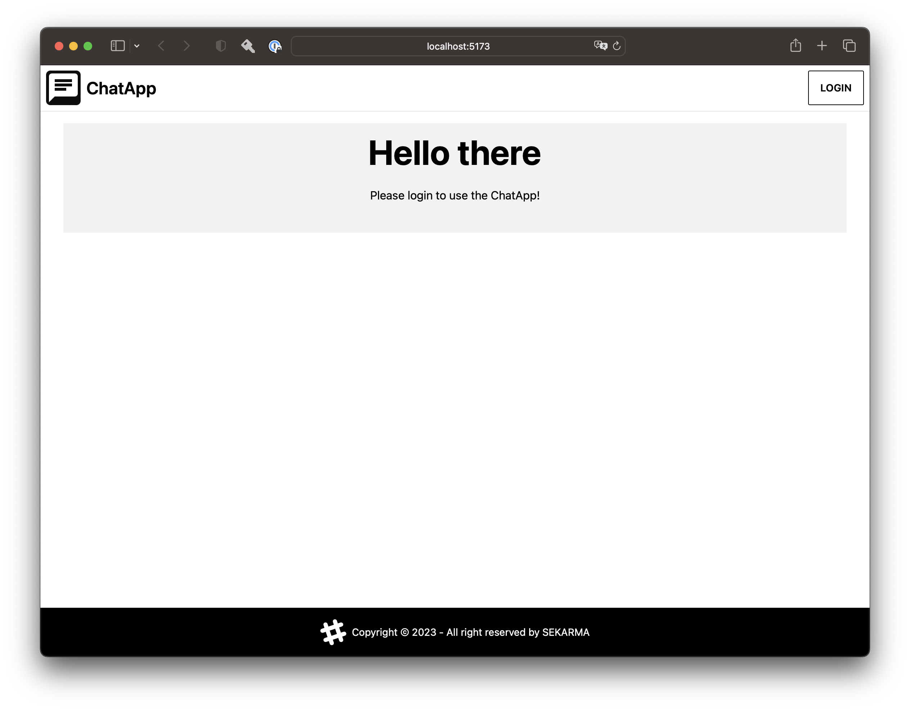
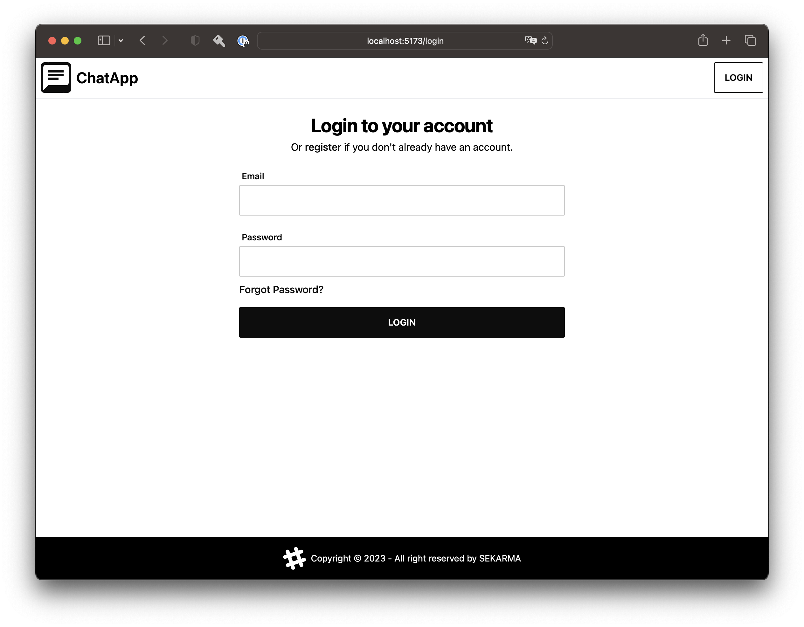
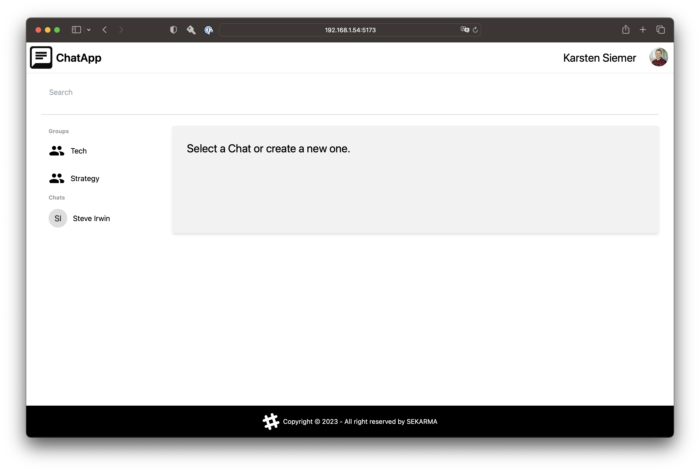
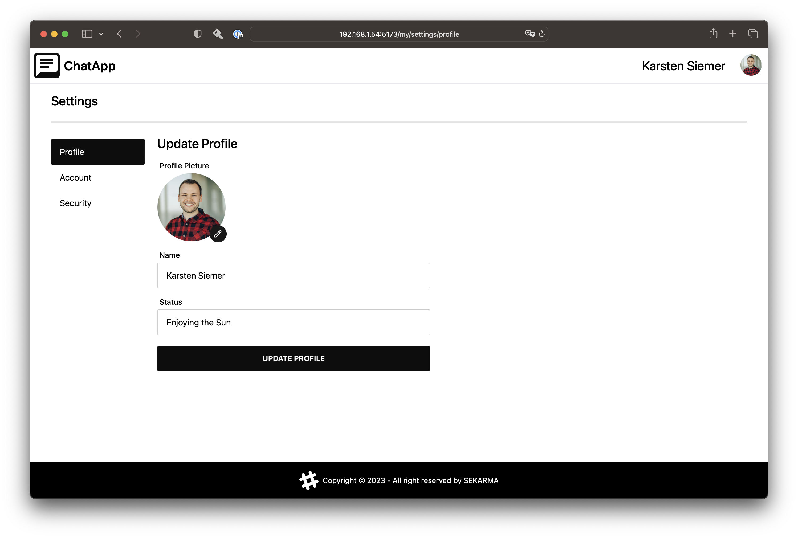
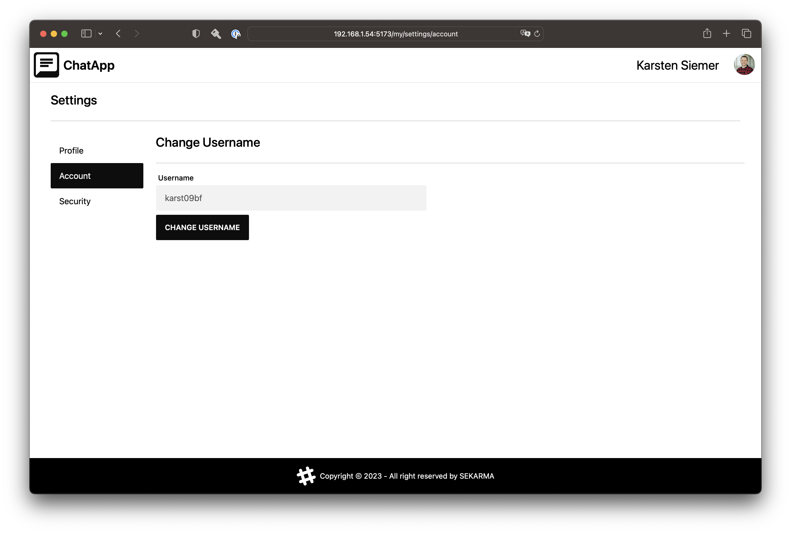
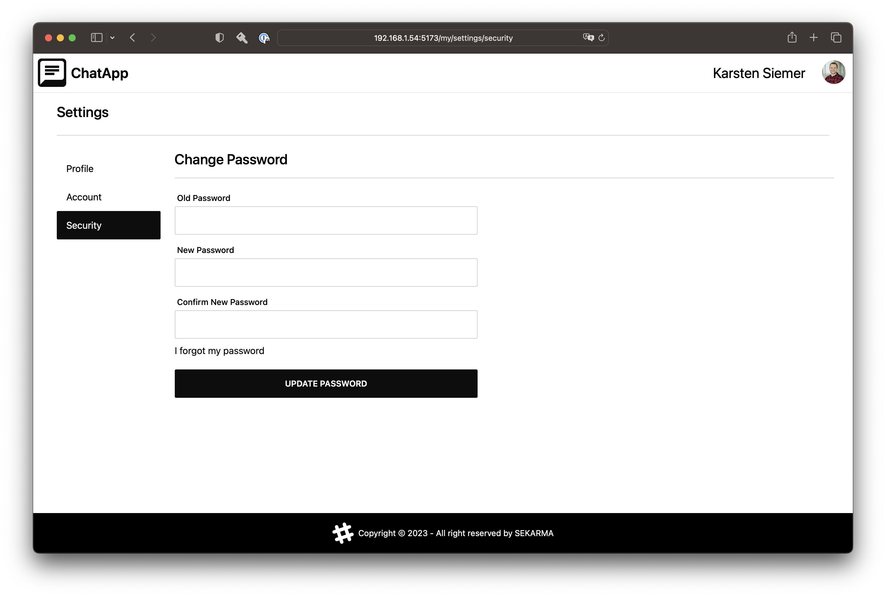
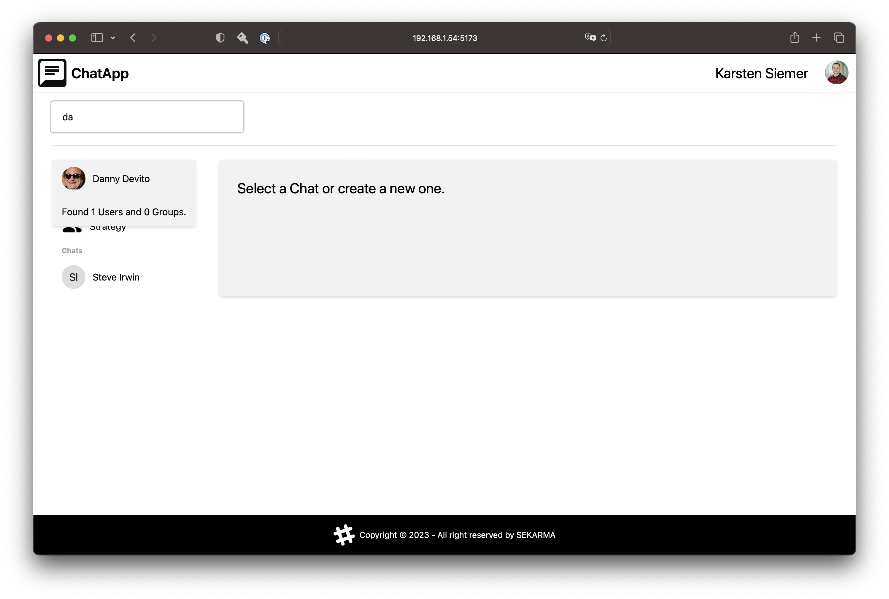
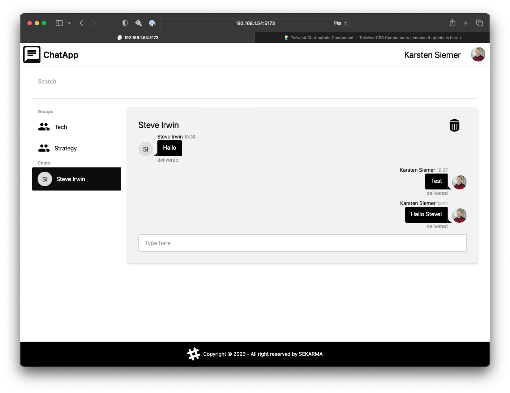

# ChatApp

Hello! This is a poc for a SvelteKit and Pocketbase realtime streaming chat application.
It uses Sveltekits stores and Pocketbase for authentication, DaisyUI for the Interface and Zod for form validation.
It features users, groups, a searchbar to look for users and groups and fully customizable user settings.

Screenshot of the App when not logged in:


Screenshot of the Apps log-in mask


Screenshot of the App when logged in


Screenshot of the App when editing profile user settings


Screenshot of the App when editing account user settings


Screenshot of the App when editing security user settings


Screenshot of the Apps search bar


Screenshot of the App when chatting


## Developing

```bash
npm install
wget https://github.com/pocketbase/pocketbase/releases/download/v0.14.0/pocketbase_0.14.0_darwin_arm64.zip
unzip pocketbase_0.14.0_darwin_amd64.zip -d ./pocketbase
npm run backend
npm run dev
```

## Building

To create a production version of your app:

```bash
npm run build
```

You can preview the production build with `npm run preview`.

> To deploy your app, you may need to install an [adapter](https://kit.svelte.dev/docs/adapters) for your target environment.

## Links

- [SvelteKit](https://kit.svelte.dev/)
- [PocketBase](https://pocketbase.io/)
- [Tailwind CSS](https://tailwindcss.com/docs/)
- [DaisyUI Components](https://daisyui.com/components/)
- [DB Schema](https://dev.to/karanpratapsingh/system-design-whatsapp-fld)
- [Tailwind Play](https://play.tailwindcss.com/)
